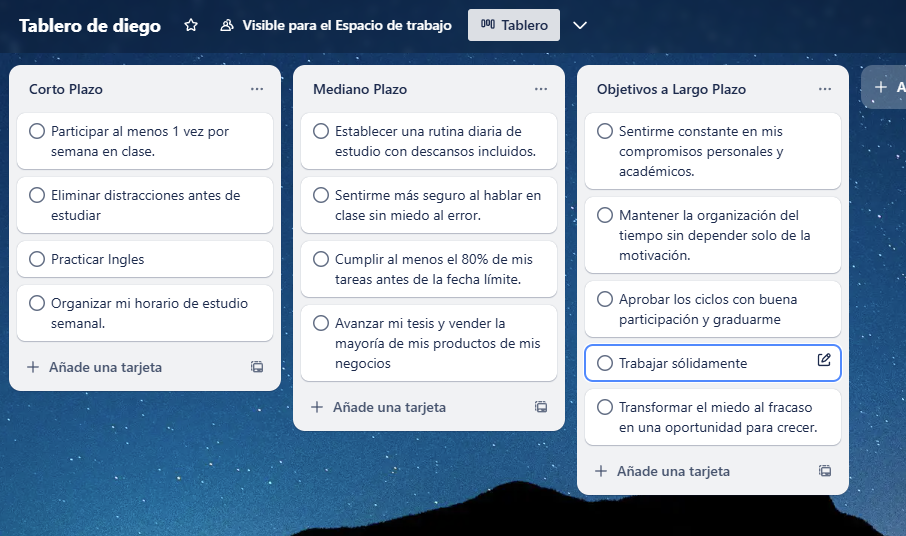

# ✍️ Parte 1: Diario de debilidades
## 📉 ¿Qué debilidades personales o académicas reconozco hoy?
#### Hoy reconozco que una de mis principales debilidades personales es el temor a fallar. A veces, este miedo me frena antes de siquiera intentarlo, haciéndome dudar de mis capacidades. En lo académico, la procrastinación es un obstáculo frecuente. Suelo dejar tareas para después, confiando en que "aún tengo tiempo", y eso termina afectando la calidad de mi trabajo y mi tranquilidad mental.

## 💡 ¿Qué estrategias puedo aplicar para mejorar en esas áreas?
#### Para enfrentar el miedo a fallar, quiero comenzar a ver los errores como oportunidades de aprendizaje en lugar de fracasos. Me ayudará recordarme que nadie nace sabiendo y que el progreso se construye con intentos, incluso si no todos salen bien.

#### Para combatir la procrastinación, empezaré a dividir las tareas grandes en partes más pequeñas y manejables, utilizando técnicas como Pomodoro y estableciendo plazos realistas. También quiero apoyarme en herramientas visuales como tableros digitales para organizarme mejor.

## 🤔 ¿A quién podría pedir ayuda o guía?
#### Puedo pedir apoyo a mis amigos más cercanos, especialmente aquellos que son organizados o motivadores. A veces, hablar con alguien de confianza o estudiar juntos puede marcar la diferencia. También podría buscar consejo con un docente o tutor si siento que necesito guía más específica en alguna materia.

# 🚀 Parte 2: Mi plan de mejora
### ✅ Objetivo académico:
#### Mejorar mi capacidad para organizar tiempos de estudio.
#### Voy a estructurar mis horarios semanales, asignando tiempos concretos para cada asignatura o proyecto. Esto me ayudará a estudiar con anticipación y evitar el estrés de último minuto.

### 💖 Objetivo emocional:
#### Trabajar en mi confianza al participar en clases. Me propondré hablar al menos una vez por semana en clase, ya sea haciendo una pregunta o compartiendo una idea. Poco a poco, eso me ayudará a sentirme más seguro.

### 🌱 Objetivo de desarrollo personal:
#### Desarrollar la constancia en mis compromisos.Voy a enfocarme en ser más disciplinado con mis rutinas, aunque no siempre tenga motivación. Entender que la constancia se construye con pequeños pasos diarios será clave.

